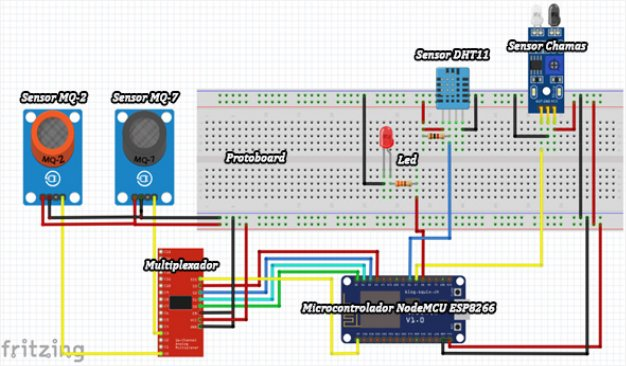
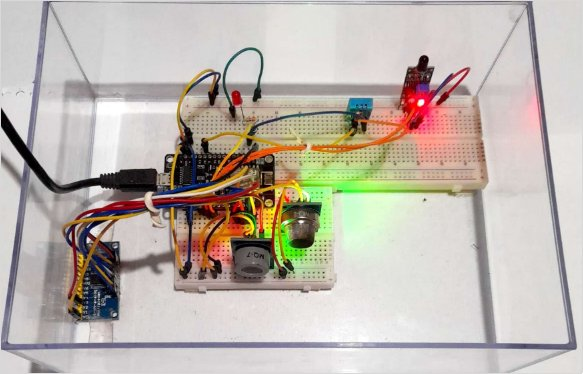
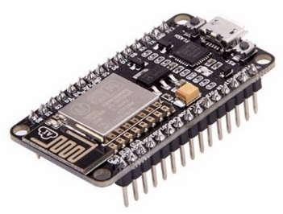
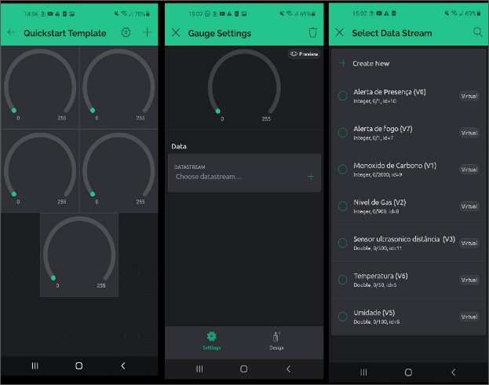
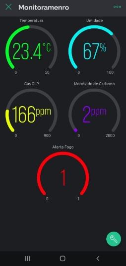
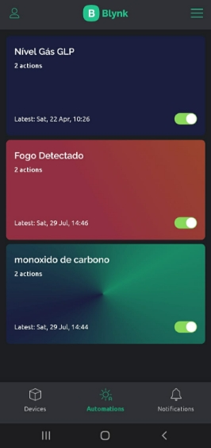
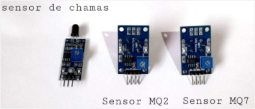

**Protótipo de baixo custo para monitoramento de dados microclimáticos e automação em ambientes internos e externos**

1. # **Descrição do protótipo**

   O dispositivo para Internet das Coisas (IoT) foi desenvolvido com o intuito de possibilitar o monitoramento, controle, automação e segurança, tanto em ambientes residenciais (internos) como em externos, com reduzido custo financeiro. Ele permite a aferição esporádica de dados climáticos e ambientais, como temperatura e umidade relativa do ar, presença de gases tóxicos e/ou inflamáveis, fumaça e, até mesmo, chamas, na área de instalação. Para tanto, é disponibilizado um aplicativo móvel (*app*) junto à Plataforma Blynk, para os sistemas operacionais Android e iOS, que servirá de ponte de acesso e comunicação entre hardware, software e usuário final.

1. ## **Uso e Aplicação**

   O uso geral deste dispositivo consiste no monitoramento e automação remota e imediata, de locais que o usuário julgar necessário, permitindo controlar e ser notificado em casos que a segurança do ambiente esteja comprometida, como possíveis incêndios, vazamento de gases tóxicos ou inflamáveis, temperaturas elevadas, fumaça, e ainda a umidade relativa do ar. 

Ao conectar a ferramenta junto a rede elétrica, o processo de inicialização ocorre e entra em um loop (ciclo “infinito”), monitorando constantemente o ambiente de instalação, enviando todas as informações obtidas junto a Plataforma IoT Blynk. Caso uma (ou mais de uma) das condições vinculadas aos sensores atribua valor positivo (sim), a aplicação executa os comandos de alerta e notificação ao usuário. Após realizar tal função, a mesma retorna para o laço (loop) de monitoramento e automação. 

Podemos observar o fluxograma com a sequência de tarefas executadas pelo dispositivo em funcionamento (Figura 1) com uma representação da arquitetura do circuito com as ligações dos sensores multiplexador e microcontrolador junto à *protoboard* (Figura 2). Adicionalmente, o protótipo em funcionamento pode ser visualizado na imagem da Figura 3.

2

**Figura 1** – Fluxograma geral de funcionamento da ferramenta de baixo custo desenvolvida

 

Fonte: Autoria Própria (2023).

**Figura 2** – Design de circuito do protótipo para medição de gás e temperatura

Fonte: Autoria Própria (2023).

**Figura 3** – Protótipo de monitoramento de gás e temperatura em funcionamento

Fonte: Autoria Própria (2023).

1. ## **Materiais básicos para montagem**

   Na tabela 1, pode-se averiguar uma lista de todos os componentes eletrônicos essências para o devido funcionamento do dispositivo. Caso o objetivo for criar um protótipo com fins educativos, alguns materiais são opcionais e podem ser desconsiderados (Tabela 2). No entanto, se a intenção for construir um dispositivo para uso tanto em ambientes internos quanto externos, todos os componentes eletrônicos, materiais e ferramentas listadas (Tabela 3) são necessários. 

**Tabela 1** – Componentes essenciais e respectivos custos

|       **Componentes Eletrônicos**        | **Quantidade** | **Valor de Mercado** |
| :--------------------------------------: | :------------: | :------------------: |
|    Microcontrolador (NodeMCU ESP8266)    |       01       |       R$ 35,00       |
| Sensor de Gás Inflamável e Fumaça (MQ-2) |       01       |       R$ 16,91       |
|   Sensor de Monóxido de Carbono (MQ-7)   |       01       |       R$ 16,91       |
| Sensor de Temperatura e Umidade (DHT11)  |       01       |       R$ 15,01       |
|  Sensor Infravermelho de Chamas (LM393)  |       01       |       R$ 6,90        |
|    Módulo Multiplexador (CD74HC4067)     |       01       |       R$ 19,57       |
|               Led vermelho               |       01       |       R$ 0,30        |
|          Protoboard 830 pontos           |       01       |       R$ 15,10       |
|          Protoboard 400 pontos           |       01       |       R$ 12,90       |
|             Resistores 330 Ω             |       02       |       R$ 1,90        |
|         Kit Jumpers Macho/Macho          |       01       |       R$ 12,26       |
|         Kit Jumpers Macho/Fêmea          |       01       |       R$ 12,26       |
|         Fonte DC 5V 3A micro USB         |       01       |       R$ 31,49       |
|                **TOTAL**                 | **R$ 196,51**  |                      |

Fonte: Autoria Própria (2023).

**Tabela 2** – Componentes opcionais e respectivos custos

|       **Componentes Eletrônicos**        | **Quantidade** | **Valor de Mercado** |
| :--------------------------------------: | :------------: | :------------------: |
|  Tela mosqueteira Nylon larg. 1m cinza   |       01       |       R$ 3,90        |
| Isotec - Verniz Protetivo 170 g / 300 ml |       01       |       R$ 67,05       |
| Caixa Hermética Vedada para instalações  |       01       |       R$ 10,36       |
|                **TOTAL**                 |  **R$ 81,31**  |                      |

Fonte: Autoria Própria (2023).

**Tabela 3** – Ferramentas necessárias e respectivos custos

|          **Ferramentas**          | **Quantidade** | **Valor de Mercado** |
| :-------------------------------: | :------------: | :------------------: |
|        Ferro de Solda 30w         |       01       |       R$ 29,93       |
|       Estanho (para solda)        |       01       |       R$ 16,90       |
| Chave de fenda pequena (1/8 x 4”) |       01       |       R$ 3,94        |
|             **TOTAL**             |  **R$ 50,77**  |                      |

Fonte: Autoria Própria (2023).

Os valores dos itens listados são baseados nos valores encontrados nos *e-commerce* dos varejistas: WJ Componentes Eletrônicos; Eletrogate; Baú da Eletrônica e Usinainfo, que mostraram ser os revendedores nacionais com menores valores para aquisição, dentre os cotados. O microcontrolador NodeMCU ESP8266 foi escolhido devido ao seu potencial de atuar de maneira autônoma, sem a necessidade de complementos para executar seus comandos, contando ainda com suporte Wifi integrado. Outra razão para sua seleção, e dos demais dispositivos eletrônicos supracitados, além de seu ótimo custo benefício, foi devido ao fato de serem empregados em inúmeros projetos e estudos, disponíveis junto as principais bases de dados científicos, além de deterem amplo acervo de manuais, protótipos e fóruns.

1. # **Montagem do protótipo de baixo custo**

   1. ## **Instruções (passo a passo)**

**Etapa 1 – Funcionamento de cada componente utilizado**

Microcontrolador (NodeMCU ESP8266) 

Desenvolvido pela empresa chinesa *Espressif Systems*, o microcontrolador ESP8266 (Figura 4) é uma plataforma *open source* (código aberto) de hardware e firmware produzida para viabilizar projetos econômicos, de baixo consumo energético, fácil implementação e elevada confiabilidade e desempenho ágil, voltados para IoT, detendo algumas vantagens como memória flash de 4 Mb e antena Wifi embutida (Oliveira, 2021).

**Figura 4** – Microcontrolador (NodeMCU ESP8266)

Fonte: Caldas (2018), pág. 19.

Além disso, o microcontrolador NodeMCU possui 17 portas de entrada ou saída, podendo ser configuradas para operar em modo digital, e uma em modo analógico, suportando programação tanto por meio da linguagem LUA, quanto da linguagem C++ (Oliveira, 2021). Um exemplo da implementação pode ser visto no vídeo de autoria de Fernando K Tecnologia (2018): <https://www.youtube.com/watch?v=slKGGrPDNpk>.

Sensor de temperatura e umidade (DHT11)

O sensor DHT11 conta com exclusiva tecnologia de conversão de sinal serial e de sensoriamento, proporcionando alta confiabilidade e excelente estabilidade a longo prazo. Este componente é calibrado em laboratório, possuindo máxima precisão, com coeficientes armazenados na memória OTP (*One Time Programed*), necessários no processo interno de leitura do sensor, que permite medir temperatura no range de 0° a 50° Celsius, com precisão de ± 2 ºC, umidade de 20 % a 90 % UR (Umidade Relativa), com precisão de ±5 % UR, e sua alimentação de operação é de 3,3 – 5 V (Aosong, 2017). A implementação detalhada do sensor de temperatura e umidade DHT11 (Figura 5) pode ser conferida junto ao vídeo de autoria de Tecnologia de Hoje (2019): <https://www.youtube.com/watch?v=Sgb7GqCUon4>.

**Figura 5** – Sensor de temperatura e umidade (DHT11)

Fonte: Franco (2019), pág. 34.

Detector infravermelho de chamas (LM393)

O sensor de chamas (Figura 6) é um componente eletrônico desenvolvido com o propósito de alertar o sistema microcontrolador sobre possível presença de fogo, em determinado local de sua instalação. 

**Figura 6** – Detector infravermelho de chamas (LM393)

Fonte: Anhesine e Rocha (2020), pág. 183. O Sensor LM393 detém sensibilidade à radiação contida na faixa espectral infravermelha, com detecção de onda de calor entre 760 a 1100 nm (nanômetros), desde que esteja até 80 cm de distância do sensor, com um ângulo de detecção de 60 °C e temperatura máxima de operação de 125 °C (Anhesine; Rocha, 2020). Sua implementação detalhada pode ser conferida no vídeo de autoria de Brincando com Ideias (2019): <https://www.youtube.com/watch?v=Gdd1zwxlWPc>.

Sensor de gases inflamáveis e/ou tóxicos (MQ-2)

Conforme o *datasheet* fornecido pelo fabricante, *Hanwei Eletronics* (2010), o sensor de gases inflamáveis e fumaça (Figura 7), usado tanto em aplicações industriais como residenciais, permite detectar gases como GLP, Metano, Propano, Butano, Hidrogênio, Álcool, Gás Natural entre outros inflamáveis, além de fumaça, com sensibilidade ajustável via potenciômetro. Ele é capaz de detectar as concentrações de gases de 200 a 10.000 *ppm* na atmosfera, ao operar em temperaturas de -20 a 70ºC, consumindo menos de 150mA a 5V (Hanwei, 2010). Sua implementação detalhada pode ser conferida junto ao vídeo de autoria de Bit a Bit (2018): <https://www.youtube.com/watch?v=uoH0qmVHyc8>.

**Figura 7** – Sensor de gases inflamáveis e/ou tóxicos (MQ-2)

Fonte: Silva e Anjos Filho (2021), pág. 15.

Sensor de monóxido de carbono (MQ-7)

Segundo Oliveira (2021), o sensor de monóxido de carbono (Figura 8), também desenvolvido pela empresa Hanwei Eletronics, utiliza um circuito elétrico simples, mas com alta sensibilidade, precisão e resposta de aferição, convertendo a mudança na condutividade, em sinal analógico, para corresponder ao sinal de saída de concentração de gás, sendo capaz de identificar concentrações de CO na faixa de 10 a 10.000 *ppm*, em condições de trabalho com temperatura entre -10 e 50 ºC e consome menos de 150mA a 5V. Sua implementação detalhada pode ser conferida junto ao vídeo de autoria de AReResearch (2017): <https://www.youtube.com/watch?v=lX2YQBl-ggQ>.

**Figura 8** – Sensor de monóxido de carbono (MQ-7)

Fonte: Coelho (2018), pág. 49.

Módulo multiplexador (CD74HC4067)

Segundo o datasheet fornecido pelo fabricante, Texas Instruments (2022), o módulo multiplexador CD74HC4067 (Figura 9) é um dispositivo comutador analógico controlado digitalmente, empregado especialmente em projetos que exigem mais entradas de pinos do microcontrolador, multiplicando suas conexões, podendo ser utilizado com Arduíno, Raspberry Pi, ESP8266, dentre outros módulos, utilizando 4 pinos digitais para controlar o fluxo de 1 pino para outros 16, permitindo ser utilizado em qualquer direção, inclusive serial e outras interfaces digitais. A temperatura de funcionamento é de -55 °C a 125 °C (Texas Instruments, 2022). Sua implementação detalhada pode ser conferida junto ao vídeo de autoria de Circuito Maker (2021): <https://www.youtube.com/watch?v=666uZTCcRGk>.

**Figura 9** – Módulo multiplexador (CD74HC4067)

Fonte: Autoria Própria (2023).

**Etapa 2 – Montagem dos componentes na *Protoboard***

De acordo com a figura 1 pode-se observar as conexões dos componentes utilizados juntamente com o microcontrolador NodeMCU Esp8266 e o multiplexador CD74HC4067 em um protoboard. É notável que o protoboard possui faixas horizontais coloridas, uma azul e outra vermelha, em suas extremidades. A faixa azul é designada para a conexão do terminal negativo, enquanto a faixa vermelha é reservada para o terminal positivo. Quanto aos pinos centrais do protoboard, eles estão interligados verticalmente permitindo facilmente conexões entre eles. 

Os sensores utilizados veem com pinos GND (Negativo), e VCC onde se conecta a alimentação de 5 volts, e além disso vem com um pino de sinal que é conectado ao microcontrolador utilizado, seja Arduíno, esp8266, esp32 ou qualquer outro. Uma observação importante é que no código pode-se definir as portas que se desejam conectar os sensores. Para uma compreensão mais clara das interconexões dos componentes, a seguir estão listadas todas as conexões realizadas:

- Led vermelho conectado à porta D8 do Esp8266
- Sensor Infravermelho de Chamas conectado à porta D7 do Esp8266
- Sensor DHT 11 conectado à porta D6 do Esp8266
- Pino D0 do Esp8266 conectado à porta S0 do multiplexador CD74HC4067
- Pino D1 do Esp8266 conectado à porta S1 do multiplexador CD74HC4067
- Pino D2 do Esp8266 conectado à porta S2 do multiplexador CD74HC4067
- Pino D3 do Esp8266 conectado à porta S3 do multiplexador CD74HC4067
- Porta A0 do Esp8266 conectado à porta SIG (sinal) do multiplexador CD74HC4067
- Sensor MQ2 conectado à saída C0 do multiplexador CD74HC4067
- Sensor MQ7 conectado à saída C3 do multiplexador CD74HC4067
- Pino EN do multiplexador CD74HC4067 interligado ao GND como na imagem 
- Pino Vin do Esp8266 conectado à faixa horizontal vermelha do protoboard
- Pin GND do Esp8266 conectado à faixa horizontal azul do protoboard

1. # **Preparação do ambiente de desenvolvimento**

   Após a montagem do circuito no protoboard, o primeiro passo foi a configuração do ambiente de desenvolvimento Arduíno IDE. Primeiramente realiza-se o download desta plataforma por qualquer navegador de internet, por exemplo, o Google. Após *download* iniciamos configurando o microcontrolador NodeMCU ESP8266, o que envolveu adicionar um URL contendo informações essenciais para a sua configuração. Para realizar isso no Arduíno IDE, você pode seguir estes passos: acesse o menu "Arquivo" > "Preferências" e selecione "URLs Adicionais para Gerenciadores de Placas". Insira o seguinte endereço: <http://arduino.esp8266.com/stable/package_esp8266com_index.json>.

Outra etapa importante foi a instalação do pacote de informações e compatibilidade da placa NodeMCU ESP8266 no Arduíno IDE. Para fazer isso, vá ao menu "Ferramentas" > "Placas" > "Gerenciador de Placas". No campo de pesquisa, digite "ESP8266". Você verá o pacote "by ESP8266 Community". É fundamental instalar esse pacote para garantir o funcionamento adequado do dispositivo. 

Para a correta compilação e a transferência bem-sucedida dos códigos de programação para o NodeMCU, foi necessário instalar o driver de fábrica do componente, conhecido como CH340G. Esse driver é fornecido pelo fabricante e possibilita o reconhecimento e gerenciamento da porta de comunicação (COM) quando o módulo é conectado ao computador via cabo USB.

Além disso, aprimorou-se a compilação do código por meio da incorporação de bibliotecas essenciais para o desenvolvimento, incluindo:

- ***ESP8266WiFi.h**:* Essencial para o correto funcionamento do microcontrolador, essa biblioteca oferece uma gama de funções para estabelecer conexões com redes sem fio.
- ***DHT.h**:* Desempenha um papel vital no funcionamento e implementação do sensor de umidade e temperatura DHT11, permitindo que o mesmo seja integrado ao código.
- ***BlynkSimpleEsp8266.h***: Essa biblioteca desempenha um papel crucial na intercomunicação entre o módulo NodeMCU ESP8266 e a Plataforma IoT Blynk.

Com a instalação do driver e a inclusão das bibliotecas mencionadas acima, o ambiente de programação ficou devidamente preparado para o desenvolvimento dos códigos que irão habilitar a funcionalidade do protótipo. Essa preparação prévia é vital para garantir um fluxo suave no processo de programação e para o funcionamento adequado do dispositivo.

1. # **Estrutura do código fonte (Código utilizando linguagem C++)**

   Estrutura do Código:

1. Parâmetros Blynk, como ID do modelo, dispositivo, *auth token* e versão do firmware, foram definidos.

1. Comandos *char auth[], const char\* ssid = ""* e *const char\* password = ""* configuraram o *token* de autenticação e as informações da rede Wi-Fi.

1. Os comandos *#define DHTPIN 12* estabeleceram a conexão do sensor DHT11.

Sensores e Atuadores:

1. Variáveis foram criadas para sensores (MQ-2, MQ-7, Sensor Infravermelho de Chamas LM393) e Led.
1. Devido às saídas analógicas dos sensores MQ-2 e MQ-7 e à limitação de entradas analógicas do NodeMCU, o multiplexador analógico/digital CD74HC4067 foi empregado para expansão.

Programação do Setup e Loop:

1. Função *void setup()* configurou entradas e saídas, incluindo os sensores utilizados e o Led.
1. Loop *while* verificou a conexão Wi-Fi.

Leitura de Sensores e Ações:

1. Leitura do sensor LM393 (chamas) acionou alertas acendendo o LED caso detecte fogo.

Sensor DHT11:

1. Sensor de umidade e temperatura foi configurado, com comandos *float umidade = dht.readHumidity()* e *float temperatura = dht.readTemperature*.
1. *Blynk.virtualWrite* definindo pinos virtuais para umidade (V5) e temperatura (V6).

Sensores MQ-2 e MQ-7:

1. Funções *getSensor0mq2()* e *getSensor1mq7()* controlaram a leitura dos sensores.
1. Multiplexador CD74HC4067 selecionou saídas para leitura e os dados foram transmitidos ao app Blynk.

O código completo e comentado pode ser conferido através do link do GitHub para melhor compreensão. A plataforma IoT Blynk foi utilizada para verificação dos parâmetros medidos pelos sensores.

1. # **Monitoramento Plataforma *IoT Blynk***

   Nesta etapa, o procedimento inicial envolveu o registro na plataforma web Blynk e logo após a conclusão do cadastro, é efetuado o download do aplicativo Blynk. Dentro do aplicativo, cria-se o que é denominado como *Device*, dando-lhes nomes de acordo com sua função. Esses *Devices* serão o local onde inseriremos nossos medidores visuais, conhecidos como *Gauges*, que serão utilizados para visualizar as aferições dos sensores. Na criação do *Device*, é importante selecionar o tipo de microcontrolador utilizado em seu projeto, podendo ser ESP8266, ESP32, ESP01, entre outros.

Na Figura 10 pode-se observar cada *Gauge* e respectivo *Datastream*, em que se pode configurar da forma que julgar conveniente, associando para cada um seu pino virtual de entrada de dados.

**Figura 10 –** *Gauges* e criação dos *Datastreams*

Fonte: Autoria Própria (2023).

Após criar o *Device* (Figura 11), selecione-o e toque em um botão com um ícone de chave, localizado no canto inferior direito do aplicativo. Em seguida, clique no símbolo "+", adicionando os cinco *Gauges* necessários para este projeto. Dado que este protótipo envolve medições de temperatura, umidade, presença de fogo/chamas, monóxido de carbono e gás GLP, cada *Gauge* deve ser configurado de acordo com essas medições específicas, o que é feito por meio de *Datastreams* (Fluxos de Dados).

**Figura 11 –** *Devices* configurados com os respectivos Fluxo de dados – *Gauges* Personalizados

Fonte: Autoria Própria (2023).

Essa definição dos pinos virtuais é crucial, pois possibilita a transmissão das leituras dos sensores para o app Blynk. A configuração desses *Datastreams* é realizada no código por meio de comandos como *Blynk.virtualWrite(V5, umidade);* em que se substitui o número do pino virtual e a variável de acordo com o sensor e o valor medido.

No caso do sensor DHT11, para medir a temperatura, foram configurados os parâmetros da seguinte forma: o pino virtual V6 foi selecionado, o tipo escolhido foi *double*, com medições na faixa de 0 a 50 °C. Similarmente, para a medição de umidade, foi utilizado também o tipo *double*, com o pino virtual V5 e medições na faixa de 0 a 100%. Já para o sensor Infravermelho de Chamas LM393, o tipo definido foi "inteiro", com medições restritas a 0 ou 1, indicando a presença ou ausência de chamas. No caso do sensor MQ7, foi atribuído o pino virtual V1, com tipo "inteiro", e medições que variam de 0 a 2000 *ppm*. Por sua vez, o sensor MQ-2 foi configurado com o pino virtual V2, também do tipo "inteiro", com medições de 0 a 900 *ppm*. Após a conclusão das etapas descritas acima, a última fase compreendeu a criação de automações (Figura 12) para notificar os usuários caso ocorram situações fora do normal. Para realizar essa configuração, basta acessar o menu de automações, onde foram definidas três ações específicas.

**Figura 12 –** Automações para notificação de situações específicas aos usuários 

Fonte: Autoria Própria (2023).

Para o monitoramento do nível de gás GLP medido pelo sensor MQ-2, estabeleceu-se que se o nível de gás GLP ultrapassar 400 *ppm*, o aplicativo emitirá uma notificação contendo uma mensagem de alerta. Além disso, existe a opção de programar o envio de um alerta via e-mail para o usuário. No caso do monóxido de carbono, medido pelo sensor MQ-7, foi determinado que caso o nível de monóxido de carbono ultrapasse 15 *ppm*, o aplicativo enviará uma notificação de alerta e também encaminhará uma mensagem ao e-mail do usuário.

No contexto do sensor Infravermelho de Chamas, definiu-se que a detecção de ocorre quando o sensor registrar um valor de 0, visto que o sensor estava configurado dessa forma de fábrica. No caso este é um ponto de atenção para quem estiver utilizando, e se deve conferir se o sensor está trabalhando em uma lógica normal ou inversa. Além disso, nessa automação, foi estipulado que o aplicativo emitirá uma notificação imediata caso detecte a presença de fogo, e também enviará um e-mail ao usuário. Todas essas automações foram configuradas para notificar o usuário uma vez a cada segundo, garantindo assim um acompanhamento em tempo real das condições monitoradas.

1. # **Testes e calibração dos sensores para o protótipo**

   Após a construção do protótipo e a programação realizada através da Plataforma Arduíno IDE, a próxima fase consistiu nos testes e na calibração dos sensores. Embora possa parecer complexo, essa é uma tarefa relativamente simples. Na Figura 13, são apresentados os três sensores empregados, os quais requereram calibração para assegurar o funcionamento adequado. 

**Figura 13 –** Sensor de Chamas, MQ2 e MQ7

Todos os sensores utilizados possuem um componente integrado azul, de formato quadrado, um *Trimpot*, ou potenciômetro ajustável. Neste manual, a lista de materiais e componentes menciona uma pequena chave de fenda, que é usada para girar esse potenciômetro no sentido horário ou anti-horário.  A configuração e calibragem detalhada do sensor MQ-2 pode ser conferida junto ao vídeo de autoria de Canal XProjetos (2019): <https://www.youtube.com/watch?v=cQVOXYz98P0&t=435s>.

É importante destacar que o potenciômetro ajustável permite ajustar a sensibilidade dos sensores. Girando-o no sentido anti-horário, o sensor torna-se menos sensível, o que significa que ele será menos propenso a detectar pequenas variações no ambiente. Por outro lado, se o potenciômetro ajustável for girado no sentido horário, o sensor torna-se mais sensível, capaz de identificar até as menores alterações nas condições ambientais. Isso oferece uma maneira flexível de ajustar os sensores de acordo com as necessidades específicas do ambiente em que o protótipo será utilizado.

Na Figura 14, nota-se dois gráficos que demonstram a concentração mínima de gás que pode ser medida pelos sensores MQ-2 e MQ-7. De maneira geral, aplicados em uma temperatura de 20° C e 65% de umidade relativa do ar, os gráficos destacam que a resistência diminui com o aumento da concentração de gás, o suficiente para detectar concentrações de Gás GLP, fumaça, propano e metano em qualquer ambiente no caso do MQ-2 e monóxido de carbono (CO) no caso do sensor MQ-7 (HANWEI, 2010).

**Figura 14** – Características de sensibilidade dos sensores MQ-2 e MQ-7

 

Fonte: Hanwei (2010), pág. 2.

Para calibrar o sensor MQ-2 e MQ-7, é recomendado girar o potenciômetro ajustável em torno de 80º no sentido horário. É importante ressaltar que esse teste de ajuste deve ser conduzido novamente, variando-se os graus de rotação do potenciômetro para obter os melhores resultados. No caso do sensor MQ-2, é normal que ele inicie suas medições em uma faixa de concentração entre 100 e 240 *ppm*. Quanto ao sensor MQ-7, que é sensível apenas ao monóxido de carbono, é esperado que suas medições variem na faixa de 1 a 10 *ppm*. Esses valores são considerados normais e dentro das características de funcionamento desses sensores.

Neste protótipo em particular, para o sensor infravermelho de chamas LM393, realiza-se um ajuste de aproximadamente 65º no sentido horário. Isso se deve ao fato de que o sensor é sensível à radiação infravermelha e, ao girá-lo nessa direção, evita-se que ele capte a radiação solar. Não é necessário que o sensor esteja extremamente sensível, já que isso poderia interferir no seu funcionamento. Caso o sensor seja ajustado em torno de 65º e mesmo assim continue captando radiação infravermelha, é indicado substituir o sensor, pois ele indicará defeito.

Uma sugestão para testar e ajustar os sensores de gás e o de chamas é utilizar o monitor serial da plataforma Arduíno IDE seguindo o código fornecido no GitHub. Primeiramente, carregue o código no microcontrolador NodeMCU ESP8266 e, em seguida, abra o monitor serial conforme na Figura 15.

**Figura 15** – Monitor Serial Arduíno IDE

De acordo com as leituras exibidas no Monitor Serial da plataforma Arduíno IDE, procede-se ajustando os valores por meio da chave de fenda pequena no TRIMPOT dos sensores de chama, MQ-2 e MQ-7. Realizam-se ajustes tanto no sentido horário como no anti-horário, monitorando as medições resultantes. Uma vez alcançados uma medição correta usando formas de gases como um isqueiro para calibrar, o ajuste é concluído e o circuito estará devidamente configurado. Assim é possível ter medições mais precisas de acordo com o ambiente em que o protótipo for utilizado.

1. # **Precauções de segurança**

   Não se recomenda manter o dispositivo em locais com demasiada temperatura, ou em contato direto com água. Luz direta não ocasionou oscilações nos resultados das aferições dos sensores. Caso deseje uma proteção maior da ferramenta, e consequentemente maior durabilidade, recomenda-se que utilize todos os componentes opcionais.

1. # **Considerações finais**

   Este dispositivo é funcional e promissor, ressaltando a grande vantagem de possuir reduzido custo de aquisição e fácil desenvolvimento e manipulação. Caso deseje implementar de maneira mais econômica, pode-se optar por apenas utilizar os componentes essenciais e as ferramentas, o que totaliza um investimento de R$ 247,28. No entanto, para obter uma ferramenta mais resistente e duradoura, aconselha-se a adquirir também os componentes opcionais, que fará com que totalize o montante de R$ 328,59, tornando-o acessível não somente para uso em ambientes fechados como abertos. Valores estes sem levar em consideração a mão-de-obra – baseados na data de 15/08/2023, podendo oscilar de acordo com a disposição dos componentes junto aos revendedores. Deve-se considerar, ainda, que as ferramentas citadas na Tabela 3, utilizadas no desenvolvimento deste dispositivo, poderão ter outras utilidades para o usuário, uma vez que são necessárias em diversas ocasiões do cotidiano.

Por fim, é oportuno recomendar que futuros projetos abordem uma ampliação deste protótipo tecnológico, agregando possíveis novas funcionalidades, como acoplar uma câmera de monitoramento, ou um sistema de gerenciamento e controle de temperatura, em que, caso constatado um possível incêndio, fumaça ou temperatura demasiadamente elevada, a ferramenta acione, automaticamente, ventiladores, aparelhos de ar condicionado, ou, até mesmo, sistema de sprinkler (conjunto de pequenos chuveiros hidráulicos interligados a um sistema de bombeamento de água), ampliando assim o nível de segurança e automação. Quando se fala em Arduíno uma vasta gama de possibilidades surge e deve-se analisar todos os casos possíveis a serem empregados.

1. # **Referências**

   ANHESINE, M. W; ROCHA, W. S. Automação Residencial por Comando de Voz. **Revista interface tecnológica**, [S. l.], v. 17, n. 1, p. 179–191, 2020. 

AOSONG, Datasheet. **Digital relative humidity & temperature sensor DHT11**. Aosong Electronics Co.,Ltd, 2017. Disponível em: <https://pdf.directindustry.com/pdf/aosong-electronics-co-ltd/digital-humidity-temperature-sensor-dht11-aosong/121567-472569.html>. Acesso em: 15 ago. 2023.

ARERESEARCH. How to use a MQ-7 carbon monoxide detector module. YouTube, 10 de março de 2017. Disponível em: <https://www.youtube.com/watch?v=lX2YQBl-ggQ>. Acesso em: 15 ago. 2023.

BIT A BIT. Arduíno - usando o módulo sensor de gás. YouTube, 21 de julho de 2018. Disponível em: <https://www.youtube.com/watch?v=uoH0qmVHyc8>. Acesso em: 15 ago. 2023.

BRINCANDO COM IDEIAS. O Arduíno detecta fogo? tudo sobre o sensor de chamas. YouTube, 4 de junho de 2019. Disponível em: <https://www.youtube.com/watch?v=Gdd1zwxlWPc>. Acesso em: 15 ago. 2023.

CALDAS, M. M. M. P. **Automação residencial**: controlando dispositivos remotamente com o microcontrolador NodeMCU. 2018. 40 f. Trabalho de Conclusão de Curso (Bacharelado em Engenharia Elétrica) – Pontifícia Universidade Católica do Rio de Janeiro, Rio de Janeiro, 2018. Disponível em: <https://www.maxwell.vrac.puc-rio.br/34305/34305.PDF>. Acesso em: 15 ago. 2023.

CANAL XPROJETOS. Como usar sensor de gás inflamável no Arduíno (MQ-2). YouTube, 7 de abril de 2019. Disponível em: <https://www.youtube.com/watch?v=cQVOXYz98P0>. Acesso em: 15 ago. 2023.

CIRCUITO MAKER. Como usar o módulo multiplexador CD74HC4067 com Arduíno. YouTube, 18 de maio de 2021. Disponível em: <https://www.youtube.com/watch?v=666uZTCcRGk>. Acesso em: 15 ago. 2023.

COELHO, Pedro Henrique da Silva. **Proposta de estação meteorológica inteligente baseada em ambientes IoT**. 2018. 94 f. Trabalho de Conclusão de Curso (Bacharelado em Engenharia de Redes de Comunicação) – Universidade de Brasília, Brasília, 2018. Disponível em: <https://bdm.unb.br/handle/10483/28637>. Acesso em: 15 ago. 2023.

FERNANDO K TECNOLOGIA. NodeMCU ESP8266: detalhes e pinagem. YouTube, 4 de maio de 2018. Disponível em: <https://www.youtube.com/watch?v=slKGGrPDNpk>. Acesso em: 15 ago. 2023.

FRANCO, Luíza Boldt. **Desenvolvimento de um protótipo para medição de corpos cetônicos utilizando Arduíno**. Trabalho de Conclusão de Curso (Graduação em Engenharia Elétrica) - Universidade Federal de Santa Catarina, Florianópolis, 2017. Disponível em: <https://repositorio.ufsc.br/handle/123456789/193221 Acesso em: 15 ago. 2023.

HANWEI, Datasheet. **Technical data MQ-7 gas sensor**. Henan Hanwei Electronics Co.,Ltd, 2010. Disponível em: <http://edge.rit.edu/edge/R13401/public/FinalDocuments/Monitor/Appendix%20B%20Sensors.pdf >. Acesso em: 15 ago. 2023.

HANWEI, Datasheet. **Technical data MQ-2 gas sensor**. Henan Hanwei Electronics Co.,Ltd, 2010. Disponível em: < https://www.mouser.com/datasheet/2/321/605-00008-MQ-2-Datasheet-370464.pdf >. Acesso em: 15 ago. 2023.

OLIVEIRA, Sérgio de. **Internet das Coisas com ESP8266, Arduíno e Raspberry PI**. 2ª ed. São Paulo: Novatec Editora, 2021.

PORTELLA, Leonardo Gomes. **O uso de software de código aberto na construção de software proprietário**. 2021.        

SILVA, Bruno Bonadio; ANJOS FILHO, João Antunes. **Dispositivo de monitoramento de focos de incêndio utilizando LoRaWan**. 2021. 33f. Monografia (Graduação em Tecnologia em Mecatrônica Industrial) – Faculdade de Tecnologia Dep. Julio Julinho Marcondes de Moura, Garça, 2021. Disponível em: <https://ric.cps.sp.gov.br/handle/123456789/7118>. Acesso em: 15 ago. 2023.

TECNOLOGIA DE HOJE. Como usar o sensor DHT11 no Arduíno. YouTube, 16 de outubro de 2019. Disponível em: <https://www.youtube.com/watch?v=Sgb7GqCUon4>. Acesso em: 15 ago. 2023.

TEXAS INSTRUMENTS, Datasheet. **High-speed CMOS logic 16-channel analog multiplexer/demultiplexer**. Texas Instruments Incorporated, 2022. Disponível em: <https://www.ti.com/lit/ds/symlink/cd74hc4067.pdf >. Acesso em: 15 ago. 2023.

1. # ` `**Licenças**

   O protótipo foi desenvolvido por Jeferson Gabriel Alves e Jeferson Ricardo Gabriel ao longo da elaboração do Trabalho de Conclusão de Curso e Estágio sob supervisão das profissionais Aline Gomes Zaffani e Natalia de Souza Pelinson. O código do protótipo está disponível no GitHub no link com Licença Apache 2.0: <https://github.com/JefersonGabriel1208/Codigo_Estagio> . 

A Licença Apache 2.0 permite a utilização, modificação e distribuição do código aberto, mas requer que os usuários que utilizam o código atribuam o trabalho original ao autor, mantendo os avisos de direitos autorais intactos. A Licença Apache 2.0 oferece flexibilidade ao permitir o uso, modificação e distribuição do software, mas exige que você inclua os avisos de direitos autorais e de mudanças quando distribuir o *software*.
